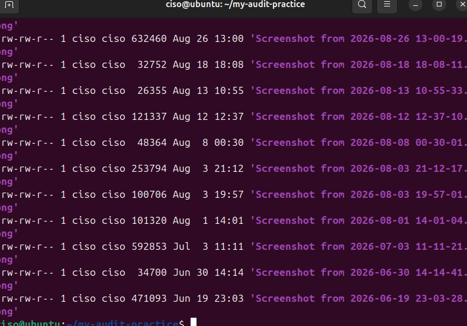

# Day 2 — Storage Layout

**Date:** 2026-09-22

## What I tackled
Understanding how the EVM packs variables into storage slots, and why the order
you declare variables in matters.

## What I did
```bash
forge build
forge inspect StorageDemo storage-layout
```

Wrote a test contract with a uint8, bool, address, and uint256, then inspected
the actual slot assignments.

## Evidence


## What I learned
Small variables (uint8, bool, address) pack together into the same 32-byte slot
when they fit — mine packed into Slot 0 together (1+1+20 = 22 bytes). The
uint256 couldn't fit alongside them, so it got bumped into its own Slot 1.
This is exactly why reordering or inserting variables in an upgradeable
contract can silently corrupt storage — a real, historically-exploited bug class.

## Links used
- [RareSkills — EVM/Solidity Storage Layout](https://www.rareskills.io/post/evm-solidity-storage-layout)

